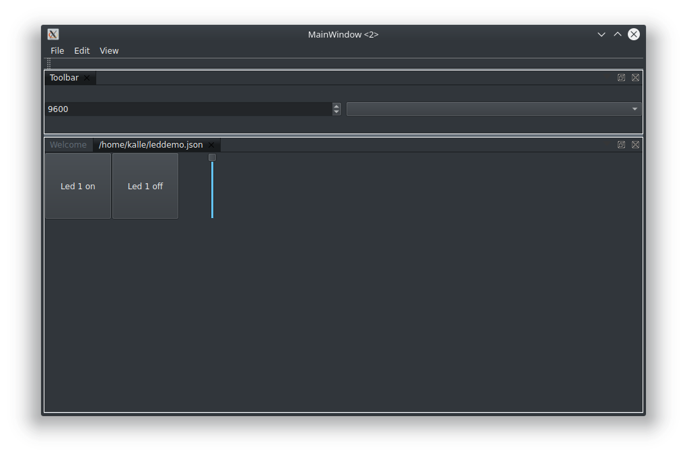
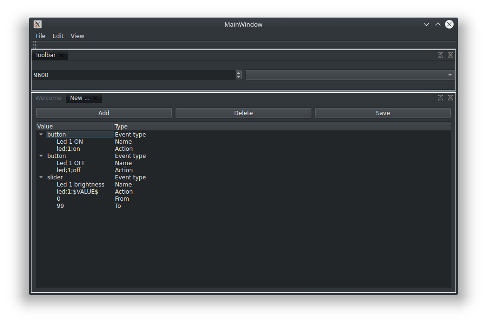

# Skui
A open source serial interface

### About
Skui is a program with which you can put serial commands on button and slider.
This way you can easily make serial controls user friendly.

### Build
Open the CMakeLists.txt in Qt Creator and compile.

### Showcase

The panel to control under Kubuntu(Linux)

The panel editor under Kubuntu(Linux)

